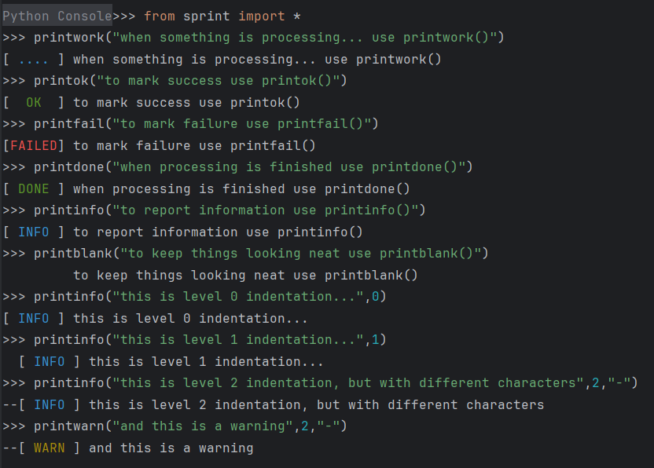

# Sprint

A colorful Python printing utility for enhanced console output with automatic indentation detection and text wrapping. Built with cross-platform color support using colorama.

## Features

- **Color-coded output** with consistent tag formatting
- **Automatic indentation detection** based on calling code context
- **Text wrapping** with configurable line lengths
- **Multiple output styles** for different types of messages
- **Cross-platform compatibility** (Windows, macOS, Linux)
- **Centralized configuration** for easy customization

## Getting Started

### Dependencies

This library requires colorama for cross-platform color support.

```bash
pip install colorama
```

### Basic Usage

Import and use the sprint functions directly:

```python
from sprint import printok, printwarn, printinfo

printok("Operation completed successfully!")
printwarn("This is a warning message")
printinfo("Here's some information")
```

### Available Functions

#### Core Functions
- `printwork(s, ...)` - Work in progress indicator with blue tag
- `printok(s, ...)` - Success confirmation with green tag
- `printfail(s, ...)` - Failure notification with red tag
- `printwarn(s, ...)` - Warning message with yellow tag
- `printblank(s, ...)` - Blank line with proper indentation
- `printdone(s, ...)` - Task completion with green tag
- `printinfo(s, ...)` - Information message with blue tag
- `printdebug(s, ...)` - Debug message with magenta tag

#### Enhanced Functions
- `printsuccess(s, ...)` - Success with checkmark icon
- `printerror(s, ...)` - Error with X icon
- `printprogress(s, ...)` - Progress with spinner icon
- `printquestion(s, ...)` - Question with question mark icon
- `printstep(step_num, total_steps, s, ...)` - Step counter with progress

#### Utility Functions (from sprint_extras)
- `printheader(...)` - Print horizontal separator line
- `printtable(headers, rows, ...)` - Print formatted table
- `printlist(items, title, ...)` - Print numbered or bulleted list

### Function Parameters

All functions accept the same parameters:

- `s` → string to print
- `lvl` → indentation level (optional, default = 0, auto-detected if 0)
- `l_pad_char` → left pad indentation character/string (optional, default = "  ")
- `max_line_length` → maximum line length before wrapping (optional, default = 80)
- `bold` → whether to print text in bold (optional, default = False)
- `auto_detect` → whether to auto-detect code indentation (optional, default = True)

### Configuration

The library uses a centralized configuration system. You can modify default values:

```python
from sprint_config import default_max_line_len, default_l_pad_char

# Modify defaults
default_max_line_len = 100
default_l_pad_char = "    "
```

### Examples

#### Basic Usage
```python
from sprint import printok, printwarn, printinfo

printok("Database connection established")
printwarn("High memory usage detected")
printinfo("Processing 1500 records...")
```

#### With Indentation
```python
def process_data():
    printinfo("Starting data processing...")
    
    for i in range(3):
        printwork(f"Processing batch {i+1}")
        # ... processing logic ...
        printok(f"Batch {i+1} completed")
    
    printdone("All data processed successfully!")
```

#### Tables and Lists
```python
from sprint_extras import printtable, printlist

# Print table
headers = ["Name", "Age", "City"]
rows = [["Alice", "25", "London"], ["Bob", "30", "Paris"]]
printtable(headers, rows)

# Print list
items = ["Install dependencies", "Configure settings", "Run tests"]
printlist(items, "Setup Steps", numbered=True)
```

### Output Example



## Project Structure

- `sprint.py` - Core sprint functions
- `sprint_utils.py` - Utility functions and text wrapping
- `sprint_extras.py` - Additional formatting functions
- `sprint_config.py` - Configuration and imports
- `test_sprint_features.py` - Basic feature tests

## Author

Original: Tanmay Lad (2019)
